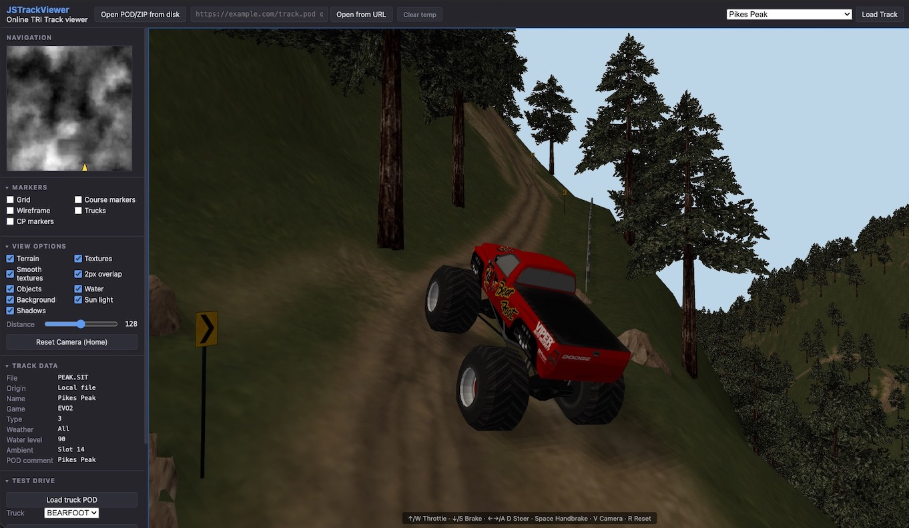

# JSTrackViewer

[](https://developer.mozilla.org/docs/Web/JavaScript)
[](https://threejs.org/)
[](https://developer.mozilla.org/docs/Web)
[](https://juanputrerasm.github.io/JSTrackViewer/)
[](LICENSE)

**A browser-based 3D track viewer for classic Terminal Reality games.**

JSTrackViewer opens POD and ZIP archives from disk or URL and renders their terrain, textures, objects, courses, ground boxes, water, backdrops, and game-specific track data in Three.js. It supports tracks from **Monster Truck Madness**, **Monster Truck Madness 2**, **Terminal Velocity**, **Fury3/F-Zone**, **Hellbender**, **CART Precision Racing**, **4x4 Evolution**, and **4x4 Evolution 2**. Archive processing happens locally in the browser.

**Live application:** [Open JSTrackViewer on GitHub Pages](https://juanputrerasm.github.io/JSTrackViewer/)



---

## Features

- **POD and ZIP loading** — open a local archive or fetch one from a URL.
- **Multi-track archives** — discover and switch between multiple `.SIT` or `.LVL` tracks without reopening the archive.
- **Broad game support** — inspect MTM/MTM2, Terminal Velocity/Fury3, Hellbender, CART Precision Racing, and 4x4 Evolution 1/2 track formats.
- **Modern MTM2 (Community Patch 3) support** — read POD1-64 archives, `.SI2` track scripts, long BIN texture names, material records, and PNG/TGA textures.
- **Detailed track rendering** — display terrain, textures, models, courses, checkpoints, ramps, ground boxes, collision boxes, trucks, water, and backdrops.
- **Route markers**: numbered checkpoint markers for MTM, MTM2, CART Precision Racing and 4x4 Evolution 1/2, plus the navigation point, tunnel and powerup markers for Terminal Velocity, Fury3 and Hellbender.
- **Hellbender level data**: the underground cavern layer with its own terrain, ground boxes and objects, plus navigation points with their objective text, animated textures, tunnels, powerups, and the per-world planet and mission names.
- **CPR racetrack layers** — render `.TRK` and `.TTX` road surfaces, walls, textures, and wireframe overlays.
- **Interactive navigation** — fly through the level, adjust the camera, and jump to a location by clicking the minimap.
- **Inspection controls** — toggle scene layers and adjust view distance, sunlight, and gamma. Layer toggles and track data fields are shown only where the loaded track has that content, so an MTM track offers no tunnel or navigation controls and only CPR offers a racetrack layer.
- **Track diagnostics** — review metadata and statistics for textures, objects, courses, ground boxes, and CPR surface and wall types.
- **Client-side operation** — archives and extracted assets remain in temporary browser storage.

## Supported content

| Content | Support |
|---|---|
| POD1 | Original Terminal Reality archive layout with 32-byte directory name fields |
| POD1-64 (Extended POD1) | POD1-compatible Community Patch 3 layout with 64-byte directory name fields |
| POD2 | Indexed archive layout used by 4x4 Evolution 1 and 2 |
| ZIP | POD archives packaged in ZIP files |
| SIT | MTM, MTM2, and CART Precision Racing track definitions |
| SIT v6 / v7 | 4x4 Evolution 1 and 2 scene scripts, placements, starting grids, and course centrelines |
| LVL + DEF | Terminal Velocity/Fury3-family and Hellbender levels and object placement |
| NAV, PUP, TDF, ANI | Terminal Velocity/Fury3 navigation points, powerups, tunnel definitions, and animated textures |
| NAV, TXT | Hellbender navigation points and mission headings |
| RA2-RA5, CL1, CL2 | Hellbender underground cavern floor, ceiling, textures, and ground boxes |
| LVL + TEX + CLR | 4x4 Evolution terrain manifest, texture table, and tile-index grid |
| TRK + TTX | CART Precision Racing road surfaces, walls, and textures |
| BIN | Static textured models and game-family scale handling |
| SMF | 4x4 Evolution static models, versions 2 to 4, including bump materials |
| VEG | 4x4 Evolution 2 vegetation, drawn with instancing |
| RAW + ACT | Legacy paletted textures with fallback palette resolution |
| RAW + ACT + OPA | 4x4 Evolution paletted textures with an 8-bit opacity plane |
| TIFF | 4x4 Evolution 2 palette-indexed art, with an optional alpha sample |
| RA0, RA1, and CL0 | Ground-box and collision data |

“POD1-64” is not a 64-bit archive format or an official new POD version. It identifies the POD1-compatible layout that widens each directory name field from 32 to 64 bytes, allowing Community Patch 3 content to use longer asset paths.

## Requirements

- A modern browser with JavaScript modules, Web Workers, WebGL, and Origin Private File System support
- An HTTP or HTTPS origin; the application cannot run correctly from `file://`
- Network access to the Three.js and fflate CDN modules

## Getting started

### Use the hosted application

1. Open [JSTrackViewer on GitHub Pages](https://juanputrerasm.github.io/JSTrackViewer/).
2. Choose **Open POD/ZIP from disk**, or paste an archive URL and choose **Open from URL**.
3. Select a track when the archive contains more than one supported track.
4. Use the keyboard, mouse, and view controls to explore the level.

> [!NOTE]
> Remote archives must be served over HTTP or HTTPS. Cross-origin servers must also allow the browser request through CORS.

### Run locally

Clone the repository and serve its root directory with any static HTTP server:

```bash
git clone https://github.com/juanputrerasm/JSTrackViewer.git
cd JSTrackViewer
python3 -m http.server 8080
```

Then open <http://localhost:8080/>. There is no build step and no package installation.

## Viewer controls

| Control | Action |
|---|---|
| Up / Down Arrow | Move forward / backward |
| Left / Right Arrow | Turn the camera |
| Page Up / Page Down | Pitch the camera |
| A / Z | Raise / lower the camera |
| Mouse drag | Look around |
| Mouse wheel | Move along the view direction |
| Home | Reset near course segment 0 |
| Minimap click | Move to the selected map position while preserving camera orientation |

## Loading from URLs

Paste a POD or ZIP location into the URL field and choose **Open from URL**. The viewer accepts absolute, root-relative, and page-relative URLs, for example:

```text
https://example.com/tracks/circuit.pod
/downloads/track-pack.zip
../archives/track.pod
```

Relative paths are resolved against the viewer page, and cross-origin URLs must allow CORS. ZIP loading uses the first POD found in the archive.

## Architecture

| Component | Role |
|---|---|
| ES modules | Application controller, archive staging, navigation, and scene management |
| Module Web Worker | POD indexing, track parsing, model decoding, and terrain construction |
| OPFS | Isolated temporary archive and extracted-asset storage |
| Three.js r169 | Terrain, model, water, backdrop, lighting, and overlay rendering |
| fflate | ZIP extraction |

```text
src/
├── app.js                  User-interface controller and track-loading flow
├── scene.js                Three.js scene, terrain, objects, and overlays
├── nav.js                  Free-flight camera navigation
├── worker-client.js        Promise wrapper for the module worker
├── zip-utils.js            POD-in-ZIP extraction
├── shared/                 OPFS, path, palette, and CPR schema helpers
└── worker/                 POD, SIT, LVL, TRK, BIN, texture, and terrain decoders
```

## Known limitations

- Rendering is intended for inspection and does not emulate physics, AI, audio, weapons, enemies, or game scripting.
- CART Precision Racing wall heights are calibrated from the wall art rather than read from the engine, so absolute wall height is approximate.
- CART Precision Racing catch fencing falls back to a synthesized panel unless `ART/CATCH3D.RAW` is reachable, since it ships in `STARTUP.POD` rather than in a track POD.
- CART Precision Racing tree walls (`wallType` 7) are drawn as a tall textured panel, not as billboarded foliage.
- Terminal Velocity/Fury3 and Hellbender tunnels are not supported. Hellbender's underground is not a tunnel: it is part of the same level and is drawn.
- Terminal Velocity/Fury3 chambers render as the hollow in the raised plateau that the level stores. Their ceiling is generated by the game, by mirroring the chamber floor and reading each square's ceiling texture from the square ten to its right, and that generated half is not reproduced.
- Hellbender's cavern floor and ceiling textures are read in that order from `.CL1`, which is a strong reading from the shipped levels rather than a documented one; see the format analysis for the evidence.
- 4x4 Evolution `.SDW` baked shadow overlays and `.RTD` grids are read and carried but not drawn, so tracks that paint shadow tiles render without them.
- 4x4 Evolution 2 material stages beyond diffuse and alpha - bump, cubic reflection, gloss, and projected shadows - are not reproduced.
- 4x4 Evolution vegetation is grounded on the drawn terrain surface and yawed by a viewer convention, because a `.VEG` record carries no orientation and its own elevation sits below the surface; `treeBiasY` is parsed but not applied.
- 4x4 Evolution water height is read on a half-unit scale, established from the stock tracks rather than from engine source; see the format analysis for the evidence.
- Standalone downloadable 4x4 Evolution `.LTE` tracks are not supported; they are a compressed format that reuses assets the track does not carry.
- Animated models and textures are not supported.
- Assets referenced by a track but absent from its POD cannot be rendered.

## Format documentation

- [4x4 Evolution 1/2 track rendering analysis](docs/4X4_EVO_TRACK_RENDERING_ANALYSIS.md)
- [CART Precision Racing track layer analysis](docs/CPR_TRACK_LAYER_ANALYSIS.md)
- [CPREdit guide](docs/CPREDIT_GUIDE.md)

## Related projects

- [JTraxx](https://github.com/juanputrerasm/JTraxx3) — desktop track editor on which JSTrackViewer is based.
- [JSTruckViewer](https://github.com/juanputrerasm/JSTruckViewer) — browser-based MTM1 and MTM2 truck viewer.
- [JSPod](https://github.com/juanputrerasm/JSPod) — browser-based POD archive and individual-asset viewer.

JSTrackViewer follows the lineage of JTraxx and the original Traxx track editor for Monster Truck Madness and Monster Truck Madness 2.

## Credits and license

Developed by **Juan Pablo Utreras** for the Monster Truck Madness Guild.

Released under the [Apache License 2.0](LICENSE).

The game names and Terminal Reality are trademarks of their respective owners. This project is an independent community tool and is not affiliated with or endorsed by their owners.
