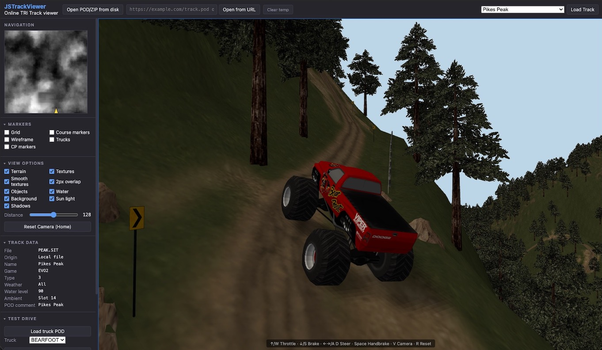

# JSTrackViewer

[](https://developer.mozilla.org/docs/Web/JavaScript)
[](https://threejs.org/)
[](https://developer.mozilla.org/docs/Web)
[](https://juanputrerasm.github.io/JSTrackViewer/)
[](LICENSE)

**A browser-based 3D track viewer for classic Terminal Reality games.**

JSTrackViewer opens the archives of **Monster Truck Madness**, **Monster Truck Madness 2**, **CART Precision Racing**, **Terminal Velocity**, **Fury3/F-Zone**, **Hellbender**, **4x4 Evolution**, **4x4 Evolution 2** and **Fly!**, and renders their levels in 3D: terrain, textures, objects, courses, skies and game-specific data. Everything runs locally in the browser.

**Live application:** [Open JSTrackViewer on GitHub Pages](https://juanputrerasm.github.io/JSTrackViewer/)



---

## Features

- **Opens archives from disk, URL or a whole folder**: POD, EPD and ZIP files, with every track of every archive in one list.
- **Nine games**: Monster Truck Madness 1 and 2, CART Precision Racing, Terminal Velocity, Fury3, Hellbender, 4x4 Evolution 1 and 2, and Fly! scenery.
- **Complete levels**: terrain, ground boxes, objects, animated and moving models, water, backdrops and skies.
- **Courses and markers**: checkpoints, AI lines, navigation points, powerups and tunnels, each toggled on its own.
- **Lighting and weather**: the game's sun position, cascaded shadows, Clear, Cloudy, Dusk and Night skies, lens flare and truck lights.
- **Test Drive**: drive a Monster Truck Madness truck on any loaded level, with collisions, surfaces and lap timing.
- **Fly! cities**: 250 km of satellite-textured terrain with skylines and bridges, streamed at full resolution near the camera.
- **Inspection tools**: wireframes, a terrain grid, hitboxes, texture filtering and track statistics.
- **Free camera**: fly anywhere, zoom with the mouse wheel, and jump around with the minimap.

Each feature is described in detail under [Feature details](#feature-details).

## Supported content

### Archives

| Content | Games | Support |
|---|---|---|
| POD1 | MTM1, MTM2, CPR, Terminal Velocity, Fury3, Hellbender | The original archive layout, 32-byte directory names |
| POD2 | 4x4 Evolution 1 and 2 | Indexed archive layout |
| EPD | Fly! | Fly!'s archive layout |
| ZIP | All | ZIP files holding one or more POD archives |

### Level files

| Content | Games | Support |
|---|---|---|
| LVL | All | The level manifest: heightfield, texture grid, palette, texture list, sky, music, lighting and water. A positional list in MTM, CPR and the Terminal Velocity family; labelled fields in 4x4 Evolution |
| SIT, SI2 | MTM1, MTM2, CPR | Scene script: objects, ramps, ground boxes, starting grid and courses (SI2 is the Community Patch 3 spelling) |
| SIT v6 / v7 | 4x4 Evolution 1 and 2 | Scene script: placements, starting grid and course centrelines |
| RAW (heightfield) | All but Fly! | Terrain height per grid point: one byte in MTM and the Terminal Velocity family, 16-bit fixed point in CPR and 4x4 Evolution |
| CLR | All but Fly! | Terrain texture per cell: a 16-bit word (texture index, mirror and rotation) in MTM1, MTM2, CPR, Hellbender and 4x4 Evolution; one byte (texture index and rotation) in Terminal Velocity and Fury3 |
| TEX | All but Fly! | The level's terrain texture list |
| TTY | MTM1, MTM2 | Ground type and depth for each terrain texture, used by Test Drive |
| LTE | MTM1, MTM2 | Baked terrain light |
| RA0 | MTM1, MTM2, Hellbender | Ground boxes: lower height of the box in each cell, 1 byte per cell |
| RA1 | MTM1, MTM2, Hellbender | Ground boxes: upper height of the box in each cell, 1 byte per cell; 0 means the cell has no box |
| CL0 | MTM1, MTM2, Hellbender | Ground boxes: the six face textures of each cell's box (south, north, east, west, top, bottom), one texture word each, 12 bytes per cell |
| RA2 | Hellbender | Underground: cavern floor height, 1 byte per cell, a full 256 steps below the surface heights |
| RA3 | Hellbender | Underground: cavern ceiling height, 1 byte per cell; where it equals the floor, the cell is solid rock |
| CL1 | Hellbender | Underground: cavern floor texture, then ceiling texture, one texture word each, 4 bytes per cell |
| RA4 | Hellbender | Underground ground boxes: lower height, encoded as RA0 on the cavern's heights |
| RA5 | Hellbender | Underground ground boxes: upper height, encoded as RA1 |
| CL2 | Hellbender | Underground ground boxes: face textures, encoded as CL0 |
| DEF | Terminal Velocity, Fury3, Hellbender | Object definitions and placements |
| NAV, PUP, TDF, ANI | Terminal Velocity, Fury3, Hellbender | Navigation points, powerups, tunnel definitions and animated textures |
| TXT (briefing) | Hellbender | Planet, location and mission text |
| Sky RAW + ACT, VOX | MTM1, Terminal Velocity, Fury3, Hellbender | Sky texture, recolouring palette and horizon colour; `STARS.VOX` star field |
| TRK + TTX | CPR | The road layer: surfaces, curbs, walls and their textures |
| WAT, VEG | 4x4 Evolution 2 | Water material and vegetation |
| AI_*.TXT | 4x4 Evolution | The computer drivers' recorded laps |

MTM1 and MTM2 levels carry all nine RA and CL grids, but only RA0, RA1 and CL0 hold anything; the six underground grids are present and empty. CPR, Terminal Velocity, Fury3 and 4x4 Evolution levels have none of them.

### Models and textures

| Content | Games | Support |
|---|---|---|
| BIN | All but 4x4 Evolution | Textured models, with each game's scale, materials and animated keyframes |
| SMF | 4x4 Evolution 1 and 2 | Models, versions 2 to 4, including bump materials |
| BSP | Fly! | Large structures such as bridges |
| RAW + ACT | All | Paletted textures, with fallback palette resolution |
| RAW + ACT + OPA | 4x4 Evolution 1 and 2 | Paletted textures with an 8-bit opacity plane |
| TIFF | 4x4 Evolution 2 | Palette-indexed art with an optional alpha sample |
| PNG, TGA | MTM2 (Community Patch 3) | High-definition textures |
| TRK (truck) | MTM1, MTM2 | Truck manifests for Test Drive |

### Fly! scenery

| Content | Support |
|---|---|
| SCF | A city's manifest: its name, coverage area and archives |
| ALT, TYP, REF, TEX, AL2 | Each globe tile's heights, cell types, texture references, texture list and finer relief |
| SCENERY.Sxx + BIN, BSP | Buildings, landmarks and bridges, placed by latitude and longitude |
| *NIGHT.EPD | City lights for dusk and night |

## Requirements

- A modern browser with JavaScript modules, Web Workers, WebGL, and Origin Private File System support
- An HTTP or HTTPS origin; the application cannot run correctly from `file://`
- Network access to the Three.js and fflate CDN modules

## Getting started

### Use the hosted application

1. Open [JSTrackViewer on GitHub Pages](https://juanputrerasm.github.io/JSTrackViewer/).
2. Choose **Open from Disk** for a POD, EPD or ZIP file, **Open from URL** to fetch one, or **Open from Folder** for a whole folder of them.
3. Select a track when there is more than one.
4. Use the keyboard, mouse, and view controls to explore the level.
5. Use the **Markers** and **View Options** panels to choose what is drawn. Every panel collapses from its heading, and controls appear only where the loaded track has that content.

> [!NOTE]
> Remote archives must be served over HTTP or HTTPS. Cross-origin servers must also allow the browser request through CORS.

### Run locally

Clone the repository and serve its root directory with any static HTTP server:

```bash
git clone https://github.com/juanputrerasm/JSTrackViewer.git
cd JSTrackViewer
python3 -m http.server 8080
```

Then open <http://localhost:8080/>. There is no build step and no package installation.

## Viewer controls

| Control | Action |
|---|---|
| Up / Down Arrow | Move forward / backward |
| Left / Right Arrow | Turn the camera |
| Page Up / Page Down | Pitch the camera |
| A / Z | Raise / lower the camera |
| Mouse drag | Look around |
| Mouse wheel | Zoom in and out, 0.5× to 8×; the Zoom slider under Distance follows it and sets it |
| Home | Reset near course segment 0 |
| Minimap click | Move to the selected map position while preserving camera orientation |
| Minimap double-click (Test Drive) | Move the truck to the selected map position, keeping its heading |
| Speed slider (under the minimap) | Scale arrow-key and A/Z travel speed, 5% to 100%; defaults to 25% and is remembered per browser |

## Test Drive

Test Drive puts a truck on the level you are viewing and lets you drive it. The truck comes from its own archive, so a track POD and a truck POD are open at the same time.

1. Load a track as usual.
2. In the **Test Drive** panel, choose **Load truck POD** and open a Monster Truck Madness or Monster Truck Madness 2 truck archive. The **Drive** button appears once a truck archive is open.
3. Pick a truck from the list.
4. Choose **Drive**. The truck starts at the first starting grid slot, or where the level starts the player; on Fly! scenery it starts on the ground under the camera, facing the same way.

While driving, the panel reports speed in mph and km/h, the selected gear, whether the gearbox is automatic or manual, engine rpm, the surface under the tires and the active camera. On a track with checkpoints it also reports the lap number, the next checkpoint, the current lap time and the best lap.

| Control | Action |
|---|---|
| Up Arrow / W | Throttle |
| Down Arrow / S | Brake and reverse |
| Left / Right Arrow, or A / D | Steer (arrows only in manual) |
| M | Toggle the manual gearbox |
| L | Toggle the truck's lights (headlights, roof light bar and beacons) |
| A / Z | Shift up / down in manual; Z from first selects reverse at a standstill, and the throttle drives it |
| Space | Handbrake |
| V | Cycle the cameras: chase near, chase far, cockpit, free orbit |
| R | Return to the start |
| Mouse drag and wheel | Swing and zoom the free orbit camera |
| Gamepad | Sticks and triggers, where the browser reports one |

> [!NOTE]
> Drive mode borrows the arrow keys while it is active, so the free-flight camera stands down until you stop driving.

## Feature details

### Opening archives

- **Open from Disk** takes a POD, EPD or ZIP file. A ZIP holding several PODs offers every track of every POD, grouped by POD.
- **Open from URL** fetches the same kinds of file from an absolute, root-relative or page-relative address, such as `https://example.com/tracks/circuit.pod`, `/downloads/track-pack.zip` or `../archives/track.pod`. Relative addresses are resolved against the viewer page. A ZIP fetched by URL opens its first POD.
- **Open from Folder** offers every track of every POD and EPD under the chosen folder, at any depth, in one list grouped by archive, along with any Fly! scenery sets in it. The archives are read where they are, never copied, and only their directories are read until a track is chosen. ZIPs inside a folder are not opened.
- An archive with more than one track opens a chooser over the viewport, and the picker in the top bar switches between tracks without reopening anything, across archives too.

### Terrain and ground boxes

- The heightfield is drawn with its texture grid, each cell's texture mirrored and rotated as its CLR entry says. CPR splits its cells along alternating diagonals, as the game does.
- MTM1 and MTM2 terrain is drawn at the brightness its LTE file bakes in.
- Ground boxes are the solid blocks that stand on single cells, each face textured from CL0. Hellbender's underground is a second layer under the surface: cavern floor and ceiling meshes covering only the hollow cells, plus the cavern's own ground boxes.
- Texture presentation: smooth or sharp (pixelated) filtering, and the two-pixel tile overlap that hides seams between terrain tiles, on by default where a game's tile sets need it.

### Objects

- Models are placed and turned as each game does it, at each game's own scale and height stretch.
- Tracks that name more than one background model show all of them. The Backdrop toggle hides that scenery and keeps the sky.
- Animated BIN models play their keyframes, blending each frame smoothly into the next. Animated textures play where the level's ANI file names them.
- Moving objects: MTM2 and 4x4 Evolution trains travel along their velocity, following the terrain and ground boxes, and 4x4 Evolution 2's banked flying objects circle overhead with whatever is attached to them, such as a plane's banner. The Moving objects toggle stops them and puts them back.
- 4x4 Evolution 2 vegetation is drawn with instancing.

### Courses and markers

- MTM, MTM2 and 4x4 Evolution tracks show the main course and each AI line, every course with its own checkbox, label and colour. A Style choice draws them three ways: Smooth, with the joins rounded off the way a truck turns; Joined, the runs as stored joined straight; or Traxx, each segment on its own and numbered at its start.
- 4x4 Evolution stores only the straight runs of a course, so the corners and hairpin legs between them are drawn back in along the roads. A rally is a one-way run, so its course ends at the finish. When a track ships its computer drivers' recorded laps, each distinct lap is its own AI line.
- CPR's five courses are named and coloured by purpose: three AI racing lines, the pit road lap and pit row. Its checkpoints are labelled pit entry, pit speed limit start and end, start/finish, then the lap's gates.
- Numbered checkpoint markers for MTM, MTM2, CPR and 4x4 Evolution. MTM1 checkpoint banners are ordinary scenery; only the invisible trigger boxes wait behind the Checkpoints toggle.
- Terminal Velocity, Fury3 and Hellbender show navigation points with their objective text, tunnels and powerups. Powerups are named (Laser, Shield Restore, AfterBurner and so on), and objects that always drop one are marked.

### Terminal Velocity, Fury3 and Hellbender

- Objects stand at their exact position within a terrain square, on the ground under them, at the size and proportions the game draws them, turned about their own origin.
- The sky is the game's flat textured ceiling above the world, recoloured for each level through its sky palette, or a star field on space levels. Fog fades the world into the level's horizon colour and follows the Distance slider. Sky and Fog have their own toggles.
- Hellbender shows each world's planet and mission names.

### CART Precision Racing road

- The road layer is built from its TRK and TTX files: surfaces, curbs, walls and catch fencing, with wireframe overlays. Closed circuits are joined across the start/finish line, the layer stops at its walls, and the road is always drawn over the terrain.
- In Test Drive the road carries the truck and the walls stop it.

### Lighting, weather and sky

- **Sun position**: every game states where its sun is, and the viewer reads it, names its compass point and lets you move it.
- **Shadows**: objects, vegetation and the driven truck cast shadows onto the terrain and the road surface, out to the full view distance, through cascaded shadow maps that are redrawn only when the camera has moved far enough to need it. Sun light and shadows are separate toggles.
- **Weather**: MTM1, MTM2, CPR, 4x4 Evolution and Fly! offer Clear, Cloudy, Dusk and Night, each with its own sky and light. Cloudy greys the backdrop scenery, Dusk and Night darken it, and at Night the moon casts faint shadows. The choice is remembered between tracks.
- **Sky style**: the weather's textured sky, or the plain Gradient sky MTM1 and MTM2 draw with their textured sky switched off. MTM1 tracks also offer Classic, the game's own flat sky from its LVL, kept at a fixed height above the camera, with its horizon haze.
- **Sun, moon and lens flare**: in a Clear or Dusk sky the sun is drawn with MTM2's lens flare, fading as terrain or objects cover it; Night shows the moon.
- **Truck lights**: MTM2 trucks carry their own lamps, with flares and beam cones. The headlights and roof light bar light the terrain and objects ahead, and switch on by themselves at Dusk and Night. Brake and reverse lights follow the pedals.

### Test Drive physics

- **Surfaces**: MTM1 and MTM2 give every terrain texture a ground type and depth (Default, Cement, Dirt, Water, Mud, Sand, Grass, Gravel, Ice, Snow, Metal, Wood or Rocks), and ground box tops take the type of their top texture. Road and metal grip best, dirt and grass a little less, gravel and sand are loose, mud and snow drag, ice barely steers, and water slows the truck the faster it goes. Deeper ground drags harder.
- **Collisions**: objects with a model collide against the model itself, so a truck can pull up against a tree trunk and drive under its foliage. Light objects with a mass, such as cones, are knocked aside; CPR's cones and signs, which carry no mass, get Monster Truck Madness 2's weights. Camera-facing billboards are not solid, except MTM2's "Collide (facing)" objects. MTM1 and MTM2 Top Crush cars flatten gradually under the truck.
- **Show hitboxes** draws a wireframe around everything the simulation can collide with.
- Picking another truck swaps it in where you are, keeping speed, heading, gearbox and camera. Loading a different track parks the truck, which stays loaded for the next one.

### Fly! scenery

- A city (San Francisco, Los Angeles, New York, Chicago or Dallas) opens from its folder: four globe tiles of terrain, about 250 km across, draped in the game's satellite imagery, with the city's buildings, airports, stadiums and bridges standing on it. A single numbered scenery EPD opened from disk shows its one globe tile.
- Terrain near the camera streams in at the imagery's full resolution, about 15 m a pixel, with the airports' finer detail textures, over the finer relief the scenery stores for rugged cells.
- The camera opens over downtown. Weather applies, and at dusk and night the cities light up.
- Test Drive works on the scenery: the truck starts under the camera, and buildings and bridges are solid.

### Navigation and inspection

- The free camera uses MTM2's field of view, about 70 degrees vertically; the mouse wheel and the Zoom slider narrow or widen it from 0.5× to 8×.
- The minimap shows the heightfield (or, for Fly!, the satellite imagery) and moves the camera where you click.
- The Markers and View Options panels toggle each layer: terrain, textures, grid, wireframes, objects, ground boxes, collision boxes, water, backdrop, sky, fog and markers. Distance, sunlight and gamma have sliders. Panels collapse from their headings, and only the controls the loaded track uses appear.
- Track Data and Stats list the track's metadata and statistics: textures, objects, courses, ground boxes, and CPR surface and wall types.

## Architecture

| Component | Role |
|---|---|
| ES modules | Application controller, archive staging, navigation, and scene management |
| Module Web Worker | Archive indexing, track parsing, model decoding, and terrain construction |
| OPFS | Isolated temporary storage for archives opened from disk or URL |
| Three.js r169 | Terrain, model, water, backdrop, lighting, and overlay rendering |
| fflate | ZIP extraction |
| [OpenPhotex](https://github.com/juanputrerasm/OpenPhotex) | Terminal Reality format parsing, vendored as plain ES modules in `src/vendor/openphotex/` |

```text
src/
├── app.js                  User-interface controller and track-loading flow
├── scene.js                Three.js scene, terrain, objects, and overlays
├── nav.js                  Free-flight camera navigation
├── worker-client.js        Promise wrapper for the module worker
├── zip-utils.js            POD-in-ZIP extraction
├── folder-contents.js      What a picked folder holds: archives and Fly! scenery sets
├── drive/                  Test Drive: truck simulation, colliders, cameras, and input
├── shared/                 OPFS, path, palette, and CPR schema helpers
├── vendor/openphotex/      OpenPhotex build: the format parsers (do not edit)
└── worker/                 SIT, LVL, TRK, BIN, texture, and terrain decoders; fly/ assembles Fly! scenery
```

Archives are read by [OpenPhotex](https://github.com/juanputrerasm/OpenPhotex), the shared Terminal Reality format library; `src/worker/pod-format.js` only feeds it bytes. The vendored copy is generated, never edited here: change OpenPhotex, then refresh it from the OpenPhotex checkout with `npm run build && npm run vendor -- ../JSTrackViewer/src/vendor/openphotex`. `src/vendor/openphotex/VERSION` records the version and commit it was built from.

## Known limitations

- Rendering is intended for inspection. Apart from Test Drive, the viewer does not emulate the games: no AI, audio, weapons, enemies, or game scripting.
- Test Drive reads Monster Truck Madness and Monster Truck Madness 2 truck archives. 4x4 Evolution trucks use a different manifest and are refused rather than misread.
- Test Drive handling is a feel-alike, not the original. Monster Truck Madness 2 keeps its mass, spring rates, gearing and tire grip in the executable rather than in track or truck files, so those values are approximated; see the [physics notes](docs/MTM2_PHYSICS_NOTES.md).
- Test Drive does not simulate other trucks, damage, or race rules beyond checkpoint order and lap timing.
- CART Precision Racing absolute wall height is approximate.
- CART Precision Racing catch fencing falls back to a synthesized panel unless `ART/CATCH3D.RAW` is reachable, since it ships in `STARTUP.POD` rather than in a track POD.
- CART Precision Racing tree walls (`wallType` 7) are drawn as a tall textured panel, not as billboarded foliage.
- Terminal Velocity, Fury3 and Hellbender tunnels are not supported.
- Terminal Velocity and Fury3 chambers render as the hollow in the raised plateau that the level stores. Their ceiling is generated by the game at run time and is not reproduced.
- Terminal Velocity and Fury3 fog distance is not read from the game; it follows the Distance slider.
- Terminal Velocity and Fury3 powerup models ship in `STARTUP.POD`, not in a level archive, so loose powerups are drawn as named markers unless the opened archive carries the models.
- The order of Hellbender's cavern floor and ceiling textures in CL1 is inferred; if it were the other way round, cavern floors and ceilings would swap textures.
- 4x4 Evolution `.SDW` baked shadow overlays and `.RTD` grids are read but not drawn.
- 4x4 Evolution 2 material stages beyond diffuse and alpha (bump, cubic reflection, gloss and projected shadows) are not reproduced.
- 4x4 Evolution vegetation stands on the drawn terrain and is turned by a viewer convention, because a `.VEG` record carries no orientation; `treeBiasY` is read but not applied.
- Standalone downloadable 4x4 Evolution `.LTE` tracks are not supported; they are a compressed format that reuses assets the track does not carry.
- Fly! scenery does not draw its beacons and windsocks, whose models ship with the game rather than the scenery, or the sectional charts in `Maps\`. Cells outside a city's photographed area use generic textures that also ship with the game, so they are drawn in flat land and water colours.
- Assets referenced by a track but absent from its archive cannot be rendered.

## Format documentation

- [4x4 Evolution 1/2 track rendering analysis](docs/4X4_EVO_TRACK_RENDERING_ANALYSIS.md)
- [CART Precision Racing track layer analysis](docs/CPR_TRACK_LAYER_ANALYSIS.md)
- [Terminal Velocity/Fury3 level format analysis](docs/TV_F3_LEVEL_FORMAT_ANALYSIS.md)
- [Hellbender level format analysis](docs/HELLBENDER_LEVEL_FORMAT_ANALYSIS.md)
- [CPREdit guide](docs/CPREDIT_GUIDE.md)
- [CART Precision Racing racetrack layer implementation guide](docs/cpr-racetrack-layer-implementation-guide.md)
- [Monster Truck Madness 2 physics notes](docs/MTM2_PHYSICS_NOTES.md)

## Related projects

- [JSPod](https://github.com/juanputrerasm/JSPod): browser-based POD archive and individual-asset viewer.
- [JSMTM2Converter](https://github.com/juanputrerasm/JSMTM2Converter): browser-based 4x4 Evolution to MTM2 track and truck converter.
- [JSTruckViewer](https://github.com/juanputrerasm/JSTruckViewer): browser-based MTM1 and MTM2 truck viewer.

JSTrackViewer follows the lineage of JTraxx and the original Traxx track editor for Monster Truck Madness and Monster Truck Madness 2.

## Credits and license

Developed by **Juan Pablo Utreras** for the Monster Truck Madness Guild.

Released under the [Apache License 2.0](LICENSE).

The game names and Terminal Reality are trademarks of their respective owners. This project is an independent community tool and is not affiliated with or endorsed by their owners.
